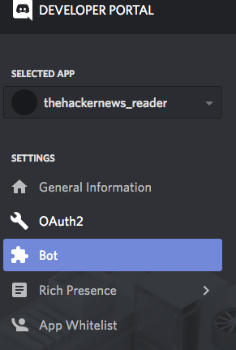

# BUCSS_Bot
A discord bot for BUCSS

## Dependancies
The bot is written in Python 3.6 so its **REQUIRED**

It requires the following packages:

1. discord.py
2. asyncio
3. feedparser
4. html2text

## Contributing!
**All pull requests are welcome!**

## Prerequisites

Add rss feeds to [feeds.json](feeds.json) in the format of:
```
,
"Insert a title here": {
    "url": "Insert RSS feed url here.",
    "date": ""
  }
```

To use the bot do the following:

1. Head to [discord application](https://discordapp.com/developers/applications/) and select an **create an application**.
2. Under settings select bot; See image below:



3. Add a bot user and copy the token. Insert the token into:
    ```
    bot.run("Insert You're Token Here.")
    ```
4. Execute the [bot.py](bot.py) and go to the link provided in the console:
    Should look something like: `https://discordapp.com/api/oauth2/authorize?client_id={bot.user.id}&scope=bot&permissions=8`
5. Select the server for the bot to be added to.
6. Configure this variable to tell the bot what channel to output the rss feed.
    ```
    channel = discord.Object(id='Insert channel_id here.')
    ```

## Authors -- Contributors

* **Daniel Brennand** - *Author* - [Dextroz](https://github.com/Dextroz)

## License

This project is licensed under the GPL License - see the [LICENSE](LICENSE) for details.